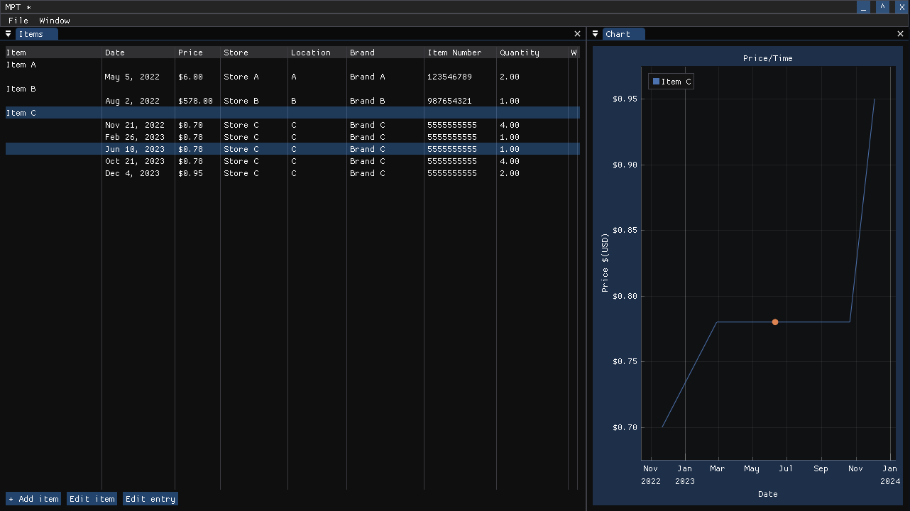

# MPT

Manual Price Tracker is a personal project I created to help track the cost of frequently purchased items over time.

## Features
- Basic item purchase information (date, store, number of items)
- Price line chart per item
- Save files stored in xml format

## TODO
- Separate lines on line chart by brand/store
- Search for items in the list
- Hotkeys, mostly for saving
